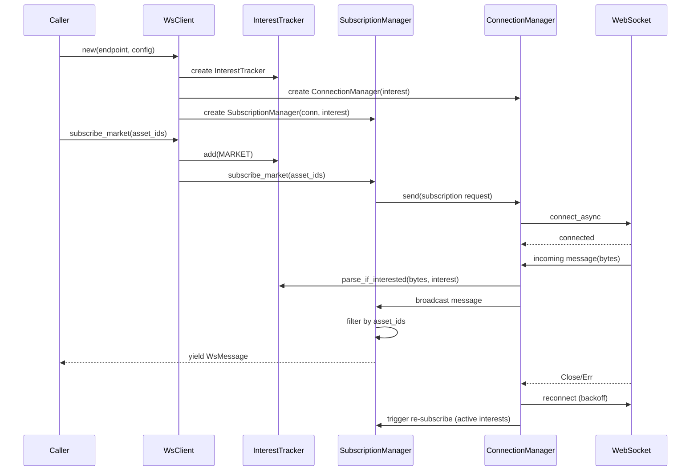

# clob ws client 时序图（Client / Interest / Subscription / ConnectionManager）

```mermaid
sequenceDiagram
    participant User as Caller
    participant Client as WsClient
    participant Interest as InterestTracker
    participant Sub as SubscriptionManager
    participant Conn as ConnectionManager
    participant WS as WebSocket

    User->>Client: new(endpoint, config)
    Client->>Interest: create InterestTracker
    Client->>Conn: create ConnectionManager(interest)
    Client->>Sub: create SubscriptionManager(conn, interest)

    User->>Client: subscribe_market(asset_ids)
    Client->>Interest: add(MARKET)
    Client->>Sub: subscribe_market(asset_ids)
    Sub->>Conn: send(subscription request)

    Conn->>WS: connect_async
    WS-->>Conn: connected

    WS->>Conn: incoming message(bytes)
    Conn->>Interest: parse_if_interested(bytes, interest)
    Conn->>Sub: broadcast message
    Sub->>Sub: filter by asset_ids
    Sub-->>User: yield WsMessage

    WS-->>Conn: Close/Err
    Conn->>WS: reconnect (backoff)
    Conn->>Sub: trigger re-subscribe (active interests)
```
