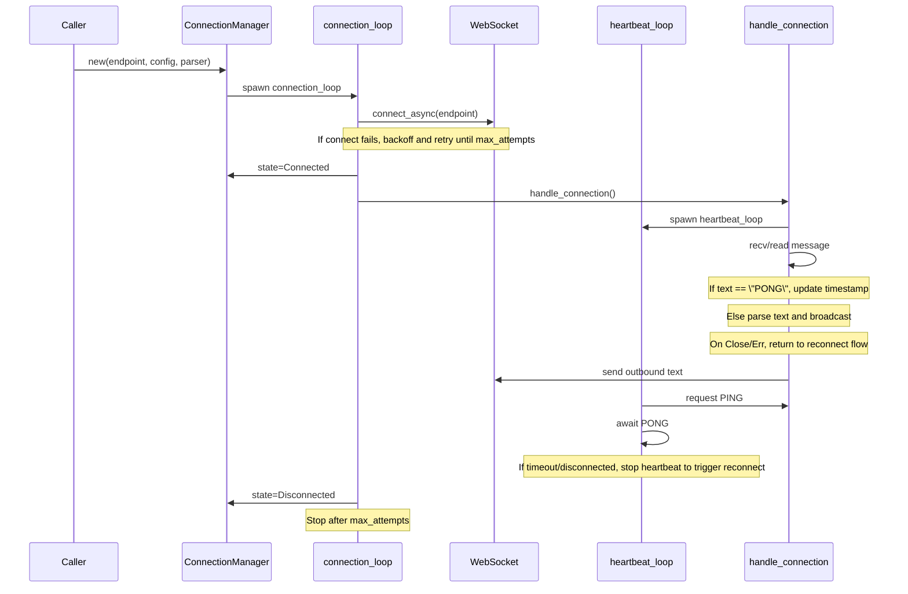

# ws/connection.rs 执行流程时序图

下面时序图描述 `ConnectionManager` 的典型生命周期：创建、连接、消息收发、心跳、重连。

## 关键节点说明

- `new()`：创建信道并启动 `connection_loop` 后台任务。
- `connection_loop()`：负责连接与重连策略（指数退避 + 最大尝试次数）。
- `handle_connection()`：拆分读写流，处理入站消息、出站消息、心跳信号。
- `heartbeat_loop()`：定时发送 PING，等待 PONG，超时即触发重连。
- `broadcast_tx`：解析后的消息广播给多个订阅者。
- `state_tx`：连接状态变化通过 `watch` 通知调用方。
